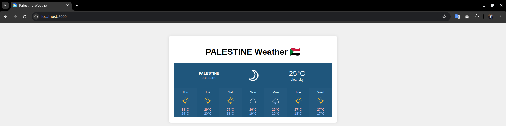
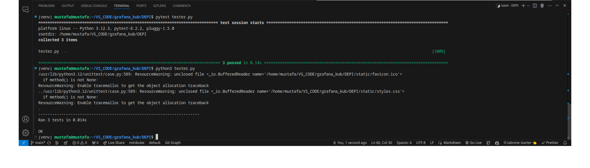
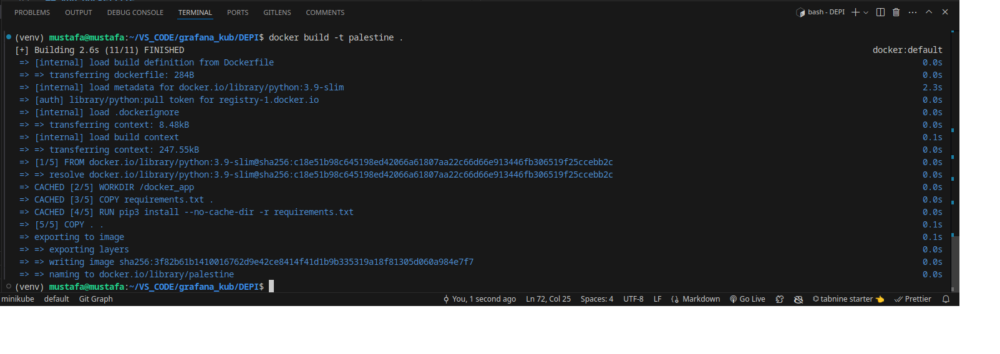
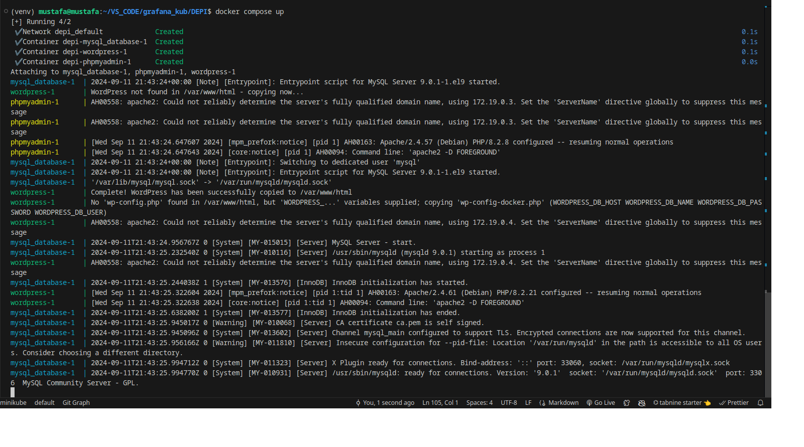
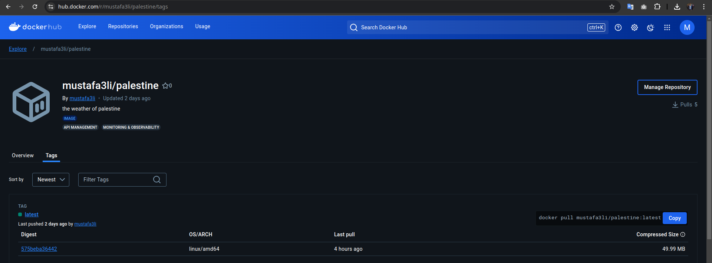
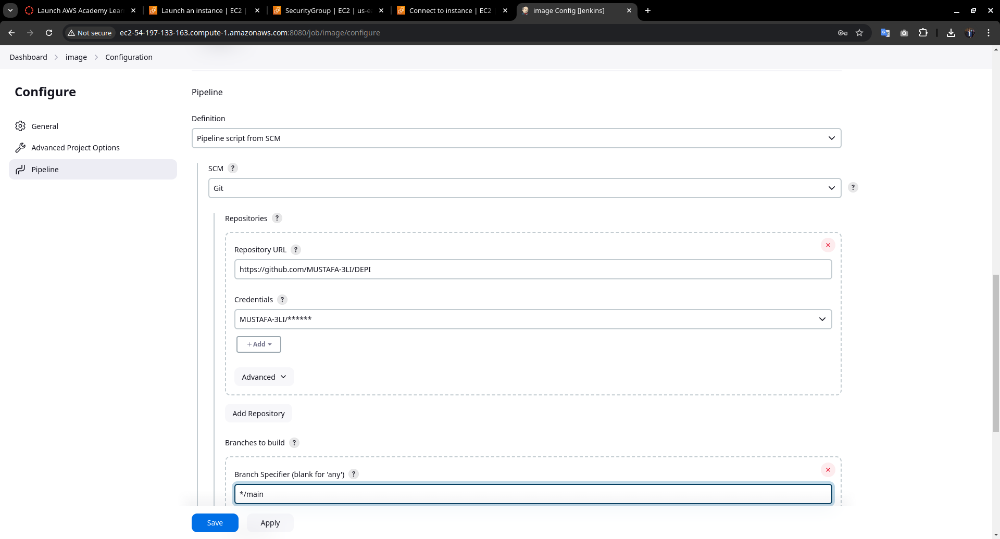
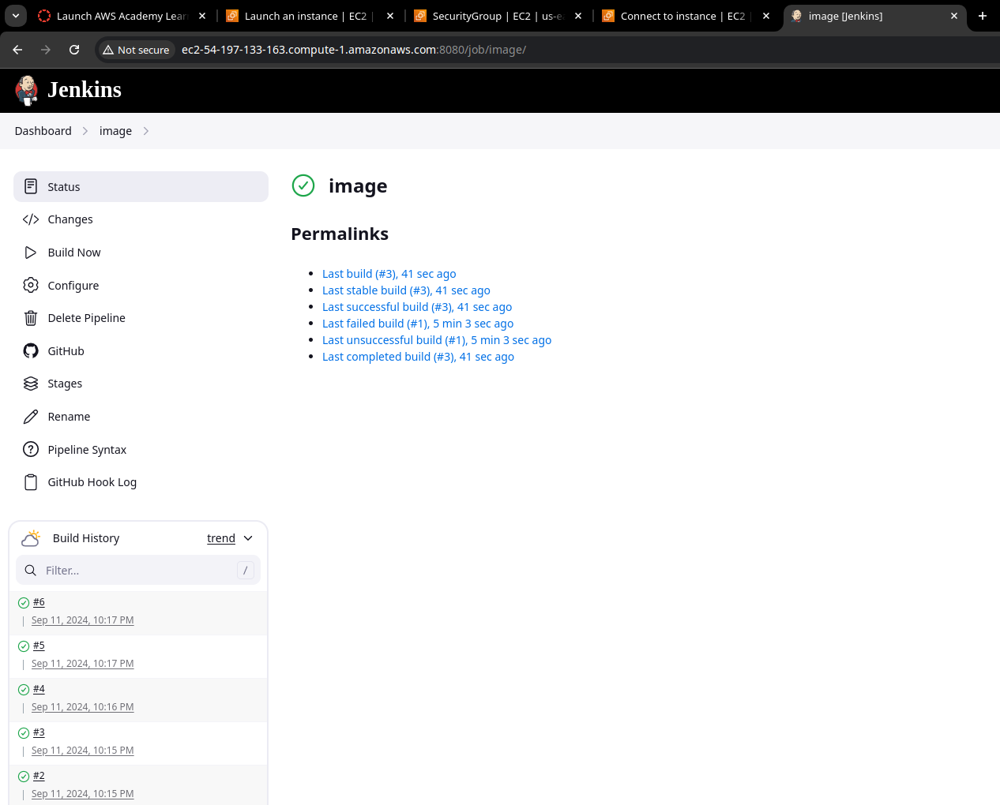

# Weather App From Implementation of API

This is a simple weather app built with Flask that displays weather information for a specific region ( user choose the region from site [https://weatherwidget.io/] and get the code of his/her choices, then get the code from site directly ) using Weatherwidget.io. The app serves static files and includes automated tests for verifying the server responses.

## Prerequisites

Before you begin, ensure you have the following installed on your device or the AWS machine:

1. **Python 3.12.3**
2. **requirements.txt**
3. **Docker**
4. **act**
5. **Jenkins**
6. **Ansible** 
7. **terraform**
8. **Cloud provider (AWS) CLI**
9. **minikube and kubectl**
10. **helm**

## Features

- Displays weather information for a specified region
- Serves static files (CSS and favicon)
- Automated testing using `unittest`

## Development

```bash
git clone https://github.com/MUSTAFA-3LI/DEPI
cd DEPI
python3 -m venv venv
source venv/bin/activate
pip install -r requirements.txt
```

# Servers

1. **Development server**:

    Run the Flask development server:

    ```bash
    python3 main.py
    ```

    The app will be available at `http://127.0.0.1:8000`.

2. **Production server**:

    Run the app with Gunicorn:

    ```bash
    gunicorn gateway
    ```

The app will be available at `localhost:8000`.



# Testing 

test the response of GET request (= 200), 
test the styles.css 's response (= 200 or 304), 
test the favicon.ico 's response (= 200 or 304)

```bash
    pytest tester.py
    python3 tester.py
```


# Docker 


This repository contains a Dockerized Python application.

## Installation

Before you begin, ensure you have Docker installed on your system.

- [Docker Installation Guide](https://docs.docker.com/engine/install/)

## Build Dockerfile
```bash
    docker build -t < image_name > .
```



## Run Dockerfile
```bash
    docker run -p8000:8000 < image_name >
```

## Pull my image locally
Pulling the Docker Image
If you prefer to pull the pre-built Docker image from Docker Hub instead of building it locally:

```bash
    docker pull mustafa3li/palestine:latest
    docker run -p 8000:8000 mustafa3li/palestine:latest
```


# Docker Compose
Docker Compose is a tool for defining and running multi-container Docker applications. It allows you to describe the infrastructure of your application using a YAML file (docker-compose.yaml). With Docker Compose, you can manage and orchestrate multiple containers as a single service, simplifying the process of creating, starting, stopping, and scaling your application.

## Activation Docker-Compose

```bash
    docker compose up -d
```



then we can open the wordpress from "[wordpress](http://localhost:5001/),
and we can open phpmyadmin from [phpmyadmin](http://localhost:7001/)

## Push my image to DockerHub
```bash
    docker login # then enter username and password of your DockerHub account
    docker push < image_name >
```



# Jenkinks


## Jenkins Pipeline

This Jenkins pipeline automates setting up a Python virtual environment, installing dependencies, running tests, and building a Docker image.

## Jenkins installation
[Install Jenkins on Linux](https://www.jenkins.io/doc/book/installing/linux)

then get the passkey of Jenkins server to login from default port `8080`

```bash
sudo cat /var/lib/jenkins/secrets/initialAdminPassword
```

## Pipeline Stages

1. **Requirements And Test**
   - Set up Python virtual environment
   - Install dependencies from `requirements.txt`
   - Run tests with `tester.py`

2. **Docker Building**
   - Build Docker image tagged as `image`

## Usage

- Add the provided `Jenkinsfile` to your repository.
- Configure a Jenkins pipeline job to use this `Jenkinsfile`.
- Ensure Jenkins has Docker and Python 3 installed on its agents.

This pipeline is triggered automaticaly according to your conditions (like: when you push your project to github) by adding some of private credintial of your repo by webhook 



or manually from Jenkins server site.


